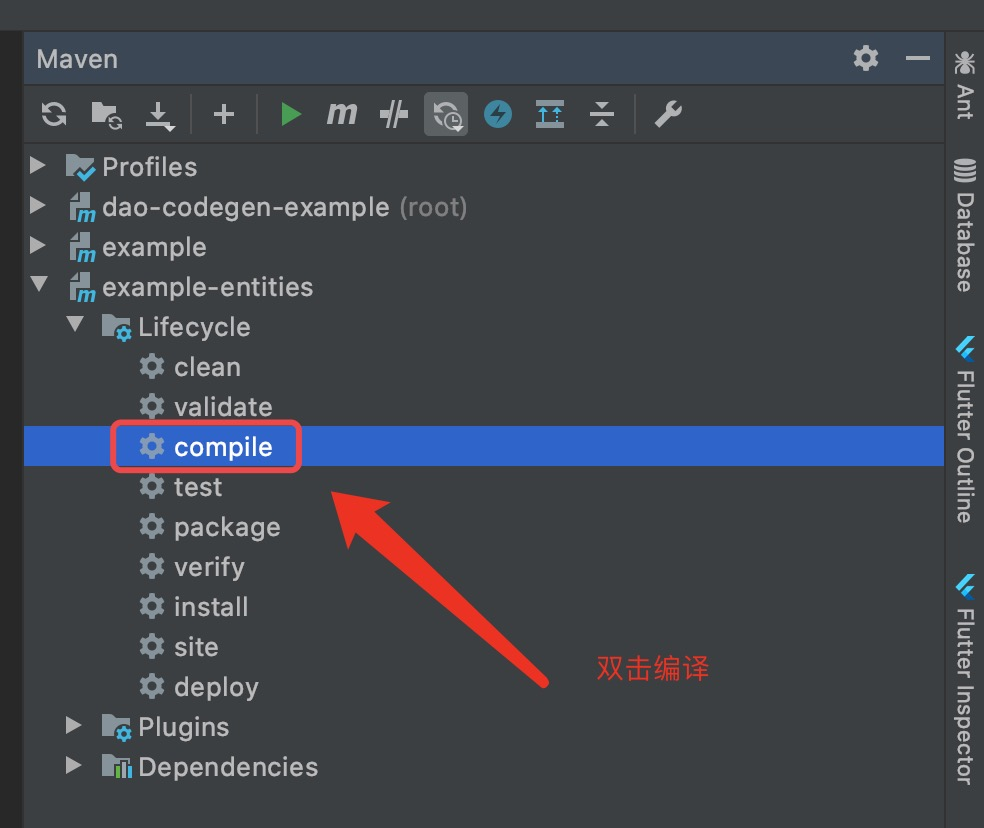
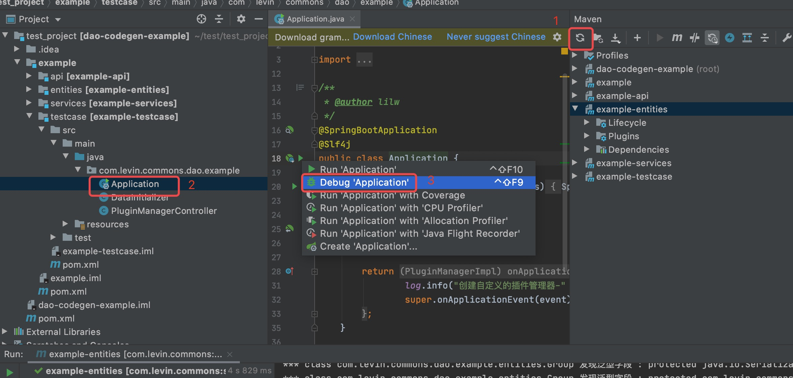

### 简介 
   
   SimpleDao是一个使用注解生成SQL语句和参数的组件。
   
   目前组件基于JPA/Hibernate，如果非JPA环境项目需要使用，可以使用  genFinalStatement()、 genFinalParamList() 方法以来获取SQL语句和参数。
   
   在项目中应用本组件能大量减少语句的编写和SQL参数的处理。组件支持Where子句、标量统计函数和Group By子句、Having子句、Order By子句、Select子句、Update Set子句、子查询、逻辑删除，安全模式等。

   SimpleDao的目标

   1、减少直接编写查询语句（SQL或JPQL），提升开发效率，减少代码量，降低编码能力要求。

   2、简化DAO层，或是直接放弃具体的Domain对象DAO层，使用支持泛型通用的Dao。

   设计思路

   通过在DTO对象中加入自定义注解自动生成查询语句。

   DAO层的在Web应用中的位置：

   client request --> spring mvc controller --> DTO(数据传输对象) --> service(含cache)  --> dao(编写查询语句并映射查询参数) --> (JDBC,MyBatis,JPA,QueryDsl)

   SimpleDao优化后的过程：

   client request --> spring mvc controller --> DTO(数据传输对象) --> service(含cache)  --> SimpleDao(使用DTO自动生成查询语句) --> (JDBC,MyBatis,JPA)
   
   测试用例类 [com.levin.commons.dao.DaoExamplesTest](./simple-dao-examples/src/test/java/com/levin/commons/dao/DaoExamplesTest.java)  
   
 
### 1 快速上手

#### 1.1 一键代码生成

  如果文档中的图片不能显示，请访问 [https://gitee.com/Levin-Li/simple-dao](https://gitee.com/Levin-Li/simple-dao) 查看。
   
##### 1.1.1 添加生成插件
   
   建立一个空Maven项目，在 pom.xml 文件中加入以下内容
     
    <properties>

        <levin.simple-dao.groupId>com.github.Levin-Li.simple-dao</levin.simple-dao.groupId>
        <levin.simple-dao.version>2.2.22-SNAPSHOT</levin.simple-dao.version> 
        <levin.service-support.groupId>com.github.Levin-Li</levin.service-support.groupId>
        <levin.service-support.version>1.1.21-SNAPSHOT</levin.service-support.version>

    </properties>
  
    <repositories> 
        <repository>
            <id>jitpack.io</id>
            <url>https://jitpack.io</url>
        </repository> 
    </repositories>

    <pluginRepositories>
        <pluginRepository>
            <!--  插件库 -->
            <id>jitpack.io</id>
            <url>https://jitpack.io</url>
        </pluginRepository>
    </pluginRepositories>

    <build>
        <plugins>

            <plugin>
                <groupId>${levin.simple-dao.groupId}</groupId>
                <artifactId>simple-dao-codegen</artifactId>
                <version>${levin.simple-dao.version}</version>

                <dependencies>
                    <dependency>
                        <groupId>${levin.service-support.groupId}</groupId>
                        <artifactId>service-support</artifactId>
                        <version>${levin.service-support.version}</version>
                    </dependency>
                </dependencies>
            </plugin>
 
        </plugins>
    </build>

##### 1.1.2 生成项目模板文件和示例文件

   在 IDEA 的 Maven 操作面板上双击插件的 gen-project-template 生成模板文件。
   
   
   
   插件将会生成一个示例模块，生成成功后，请刷新项目。
   
     
##### 1.1.3 编译项目

   在生成好的实体模块上编译项目。
    
   

##### 1.1.4 生成代码

   在生成好的实体模块上，双击插件的 gen-code 开始生成代码。
   
       
    
   代码生成插件会生成服务类，控制器类，spring boot 自动配置文件，测试用例，插件类等，后续加入会生成 vue和 react 的页面代码。
         
##### 1.1.5 启动程序和查看运行结果
   
   在Maven操作面板上刷新项目，然后启动项目。
    
        
           
   项目启动成功，点击控制台的链接查看运行结果。    
   
       
   
   So Easy!  
        
#### 2 简单才是美
   
   根据查询对象生成 SQL 语句和参数。
   
   1）定义查询对象
  
       /**
        * 数据传输对象(兼查询对象，通过注解产生SQL语句)
        */
      @Data
      @TargetOption(entityClass = TestEntity.class)
      public class TestEntityStatDto {
             
          @Min
          Long minScore; //当minScore字段名在实体对象中不存在时，会尝试自动去除注解的名字 minScore -> score
          
          @Max
          Long maxScore;
      
          @Avg
          Long avgScore;
      
          @Count
          Long countScore;
      
          @GroupBy
          @NotIn
          String[] state = {"A", "B", "C"}; 
      
          @Contains
          String name = "test"; 
      }
   
   2） 执行查询   
        
         @Autowired
         SimpleDao dao;
         
         dao.findByQueryObj(TestEntityStatDto.class,new TestEntityStatDto());   

   生成以下 SQL 语句
   
            Select 
            Min( score ) , 
            Max( score ) , 
            Avg( score ) , 
            Count( 1 ) , 
            state  
            From com.levin.commons.dao.domain.support.TestEntity     
            Where 
            state NOT IN (  ?1 , ?2 , ?3  ) 
            AND name LIKE '%' ||  ?4  || '%'  
            Group By  state
     
#### 3 用户手册
     
   其它请查看 [用户手册](./manual.md) 
 

